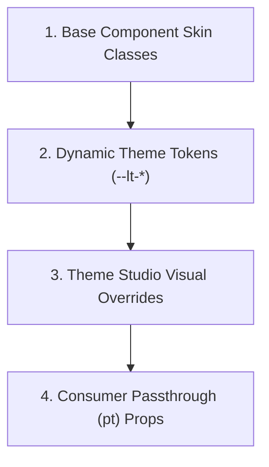

# Parts & Passthrough (`pt`) Contract

LaughTale components are built with addressable sub-parts and a standardized passthrough API (`pt`), ensuring full customizability for both Theme Studio visual authoring and developer overrides.

---

## 🎯 1. Part Addressing (`data-part`)

Every meaningful sub-element of a component is decorated with a stable `data-part` attribute:

| Component | Standard Part Names |
| :--- | :--- |
| **Select / Dropdown** | `root`, `trigger`, `label`, `indicator`, `panel`, `list`, `item`, `emptyMessage` |
| **Accordion** | `root`, `tab`, `header`, `trigger`, `title`, `indicator`, `content`, `body` |
| **Dialog / Modal** | `root`, `mask`, `container`, `header`, `title`, `closeButton`, `content`, `footer` |
| **DataTable** | `root`, `header`, `table`, `thead`, `tbody`, `row`, `cell`, `paginator`, `empty` |
| **Toast** | `root`, `container`, `message`, `icon`, `text`, `summary`, `detail`, `closeButton` |

---

## 🎨 2. Override Precedence Hierarchy

Styles, classes, and attributes are resolved in a deterministic, strict 4-level precedence cascade:



1. **Default Component Skin:** Base structural classes (`p-select`, `p-component`).
2. **Theme Tokens:** Cascading CSS variables (`var(--lt-color-surface-card)`, `var(--lt-radius-md)`).
3. **Theme Studio Overrides:** Visually authored per-part class and style rules.
4. **Consumer Passthrough (`pt`):** Specific per-part overrides provided in props or TagHelpers with highest specificity.

---

## 💻 3. Consumer Passthrough (`pt`) Usage

### TagHelper Syntax:

```razor
<island-select 
    name="themeSelector" 
    options="@ThemeOptions"
    pt="@(new {
        trigger = new { @class = "shadow-lg ring-2 ring-emerald-500", aria_label = "Choose active theme" },
        panel = new { @class = "backdrop-blur-md bg-opacity-95" },
        item = new { @class = "hover:bg-emerald-50 hover:text-emerald-900" }
    })" />
```

### TypeScript / Client API:

```typescript
import { resolvePart, applyPart } from 'laughtale';

// Resolves combined classes, inline styles, and attributes
const { className, style, attributes } = resolvePart('trigger', 'p-select-trigger', {
    trigger: {
        class: 'my-custom-trigger',
        style: { borderColor: 'var(--lt-primary-500)' },
        'data-testid': 'select-trigger-btn'
    }
});
```

---

## 🛡️ 4. Design Guidelines for Island Authors

- **Never use hardcoded hex values in component markup:** Always reference semantic tokens like `var(--lt-color-surface-ground)` or `var(--lt-color-text)`.
- **Use Logical CSS properties for RTL:** Use `margin-inline-start`, `padding-inline-end`, `inset-inline-start` instead of physical `left`, `right`.
- **Bind Lifecycle Listeners to `ctx.signal`:** Ensure every event listener and timer uses the `IslandContext.signal` abort lifecycle.
